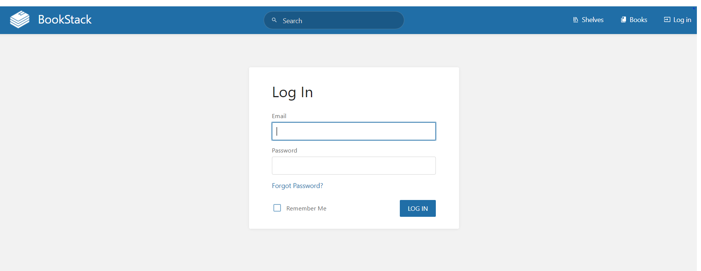

# Installation

* Checking the release, hostname, and fetching essential properties and release requisites.

```c
lsb_release -cd
hostname
hostname -I
whoami
getconf LONG_BIT
apt install -y build-essential software-properties-common curl gdebi net-tools wget curl sqlite3 dirmngr nano lsb-release
apt-transport-https
```

*  Including **Apache2, PHP, MariaDB** modules:

```c
add-apt-repository ppa:ondrej/php -y
apt-get update ; apt install -y apache2 mariadb-server mariadb-client php7.0 php7.0-cli php7.0-fpm php7.0-cgi php7.0-bcmath php7.0-curl php7.0-gd php7.0-intl php7.0-json php7.0-mbstring php7.0-mysql php7.0-opcache php7.0-sqlite3 php7.0-xml php7.0-zip php7.0-snmp php7.0-json php7.0-imap php7.0-common php7.0-tidy php7.0-mcrypt php7.0-pgsql php-pear
a2enmod dir env headers mime rewrite setenvif
sed -i "s/;date.timezone.*/date.timezone = UTC/" /etc/php/7.0/cli/php.ini 
echo ServerName 127.0.0.1 >> /etc/apache2/apache2.conf
systemctl start apache2 mariadb 
systemctl enable apache2 mariadb
```

* Securely installing **MySQL**:

```c
mysql_secure_installation
```

* Creating a **MariaDB** database:

     After installing Mysql you will find a SQL prompt. Execute the following

```c
mysql -u root -p
create database db;
grant all on db.* to 'dbuser'@'localhost' identified by 'dbpass’;
quit
curl -sS https://getcomposer.org/installer | sudo php -- --install-dir=/usr/local/bin --filename=composer
cd /var/www/html/ ; git clone https://github.com/BookStackApp/BookStack.git --branch release --single-branch
cd BookStack/ ; composer install
cp .env.example .env
nano .env
php artisan key:generate
php artisan migrate
chown -R www-data:www-data /var/www/html/ ;
chmod -R 755 /var/www/html/
```

* Next set up an **Apache virtual host**.

```c
gedit /etc/apache2/sites-available/new-domain.conf
```


_If gedit is not supported install it using_ _**apt gedit install**_ _on your screen. Include this script in the .conf file._


```c
<VirtualHost *:80>
 ServerAdmin admin@new-domain.com
 DocumentRoot /var/www/html/BookStack/public
 ServerName www.new-domain.com
 <Directory /var/www/html/BookStack/public/>
 Options FollowSymlinks
 AllowOverride All
 Require all granted
 </Directory>
 ErrorLog ${APACHE_LOG_DIR}/new-domain_error.log
 CustomLog ${APACHE_LOG_DIR}/new-domain_access.log combined
</VirtualHost>
```


* After editing, run the following commands

```c
a2ensite new-domain
a2dissite 000-default.conf
apache2ctl configtest
echo "192.168.1.50 www.new-domain.com" >> /etc/hosts
systemctl reload apache2
```

*  After reloading the apache2 server **login** with the provided credentials in the new domain.

[http://www.new-domain.com](http://www.new-domain.com/)

_Username_: [admin@admin.com](mailto:admin@admin.com)

_Password_: **password**



To test the  UI platform and gain first- hand experience, use the [demo site](https://demo.bookstackapp.com/) provided by Bookstack. You can also check their features, overviews, and settings [here](https://www.bookstackapp.com/).

